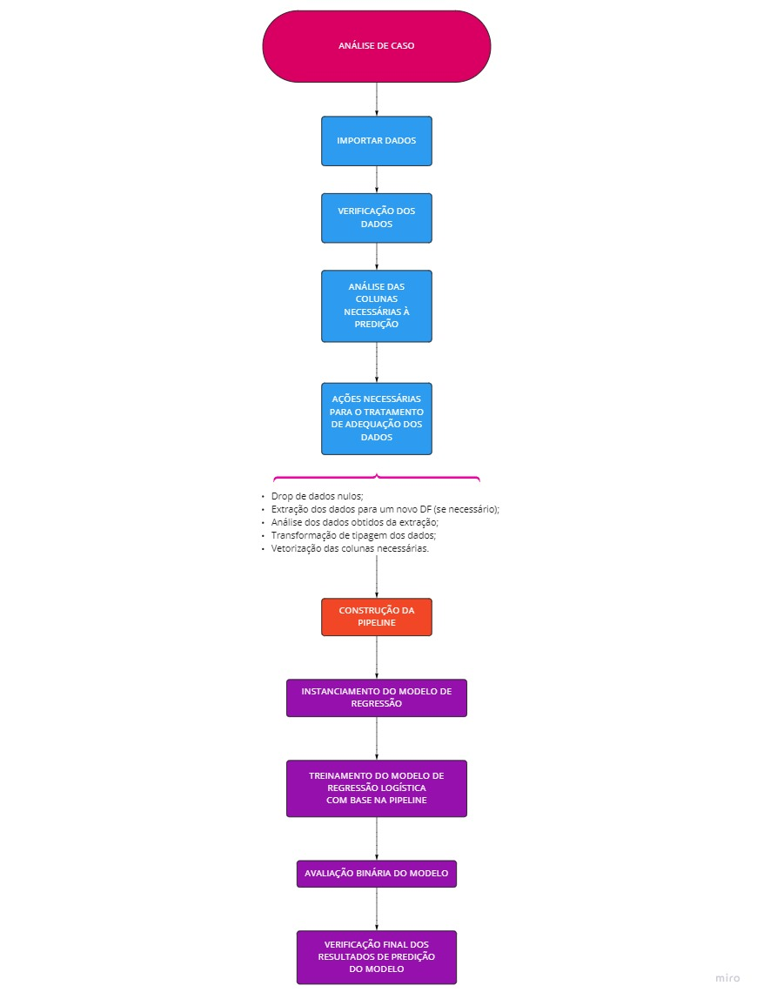

<h1>Projeto - Regressão Logística</h1> 
<h2>CASE:</h2>
<h3>Você foi contratado por uma das principais agências de marketing para ajudá-los com a rotatividade de clientes.  Essa agência tem muitos clientes que usam seu serviço específico que produz anúncios para os clientes ou sites de clientes, e eles notam que tem um bocado de clientes em excesso e atualmente selecionam aleatoriamente gerentes de contas para cada cliente.  
Eles querem que você crie um modelo de aprendizado de máquina que ajudará a prever quais clientes irão parar de comprar seus produtos para que possam distribuir seus gerentes de compras de forma a ajudar os com o maior risco de deixar de usar seus produtos.  
Crie um algoritmo que preveja quais dos futuros clientes têm maior probabilidade de abandono para que a empresa possa distribuir seus gerentes corretamente de acordo com os dados.  </h3>
<h2>Fluxograma do Processo:</h2>

